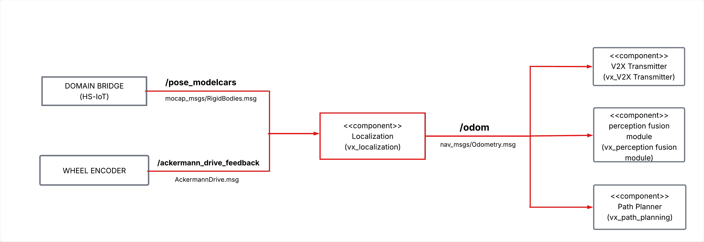
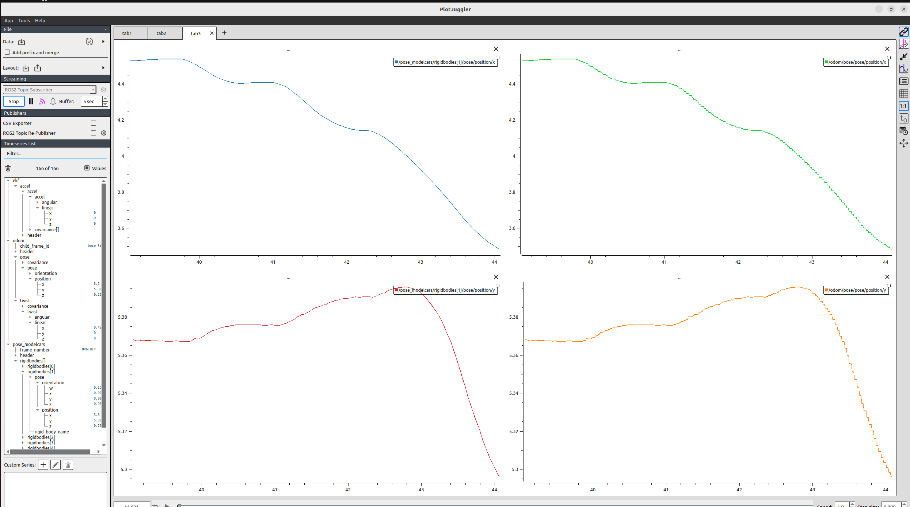
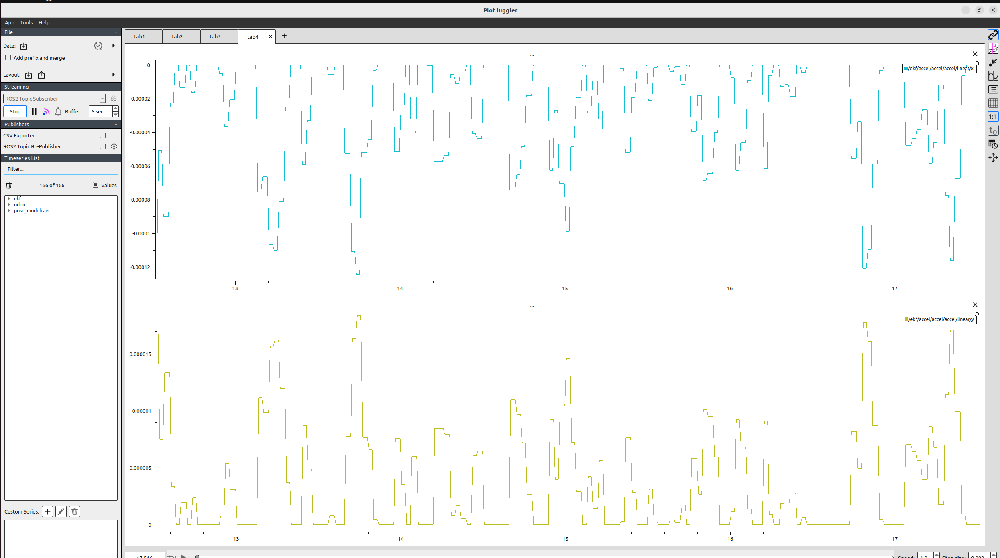
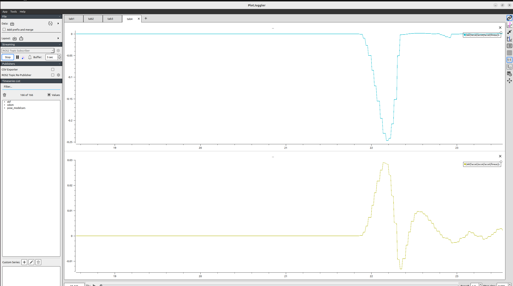
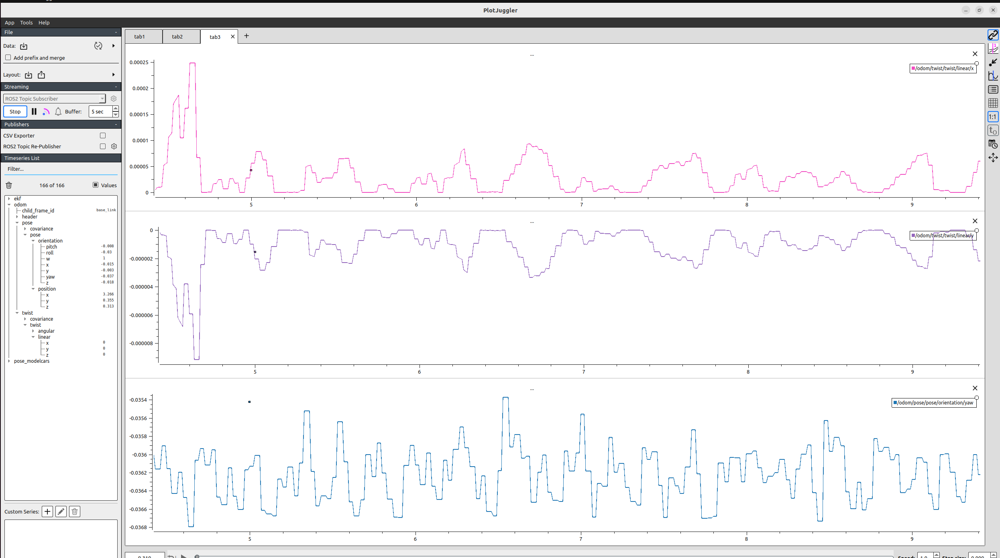
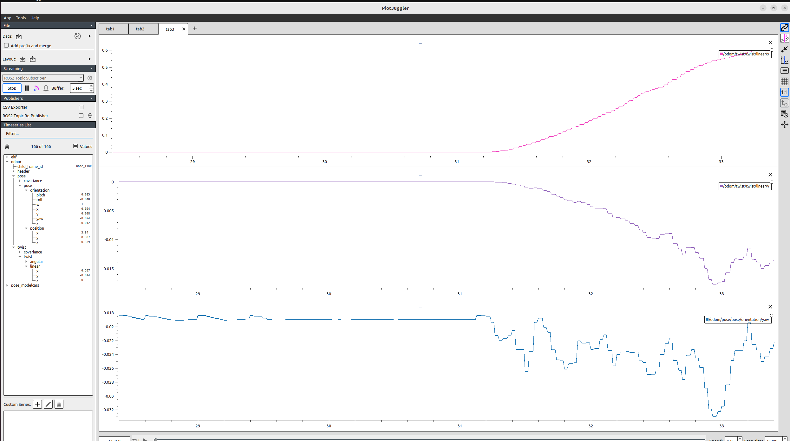

[[Monika Nagarajarao]https://github.com/Monika3106/Localization.git)  


## 📌 Table of Contents
- [User Stories](#-user-stories)
- [Overview](#-overview)
- [Component Architecture](#-component-architecture)
- [ROS 2 Topics](#-ros-2-topics)
- [Component Functionalities](#-component-functionalities)
- [Module 6 Improvements](#-module-6-improvements)
- [Installation & Setup](#-installation--setup)
- [Interface Test Procedure](#-interface-test-procedure)
- [Feature Test Strategy](#-feature-test-strategy)
- [Unit & Coverage Testing](#-unit--coverage-testing)
- [PlotJuggler Evaluation](#-plotjuggler-evaluation)


## 🎯 User Stories

- **US-1 –  Scenario-Based Feature Validation and Gap Identification in Model City**  
  Link: [Miro – US-1](https://miro.com/app/board/uXjVJfaT4fM=/?moveToWidget=3458764658313961449&cot=14)
- **US-2 – OptiTrack Freeze Detection and Fallback Localization**  
  Link: [Miro – US-2](https://miro.com/app/board/uXjVJfaT4fM=/?moveToWidget=3458764656304096540&cot=14)
- **US-3 –  EKF Prediction and Dead-Reckoning Using Wheel Speed During Fallback**  
  Link: [Miro – US-3](https://miro.com/app/board/uXjVJfaT4fM=/?moveToWidget=3458764656304096757&cot=14)
- **US-4 – Wheel-Speed-Based EKF Prediction During OptiTrack Fallback**  
  Link: [Miro – US-4](https://miro.com/app/board/uXjVJfaT4fM=/?moveToWidget=3458764656304595816&cot=14)
## 📖 Overview

The **Localization Node** helps the shuttle know its **current position, direction, velocity and acceleration**.

It does this by:
- Reading motion capture data from `/pose_modelcars` (OptiTrack, `mocap4r2_msgs/msg/RigidBodies`).
- Running an **Extended Kalman Filter (CTRA model)** to estimate pose, velocity, acceleration and yaw rate.
- Publishing the filtered state as odometry on `/odom`.
- Publishing estimated acceleration on `/odom_accel`.
In case OptiTrack pose data becomes frozen while the vehicle is moving, the node switches to a fallback localization mode.
During fallback, wheel speed is used for dead reckoning and EKF prediction-only operation, ensuring continuous odometry output for other modules.

Other modules like **Path Planning**, **Perception Fusion**, and **V2X** use this data to plan routes and share the vehicle state.


## 🏗️ Component Architecture



### 🧍 Responsible
- **Component:Localization(`localization_kf/localization`)
- **Responsible:** Monika Nagarajarao

### ⚙️ Functional Description 
- Implements an **Extended Kalman Filter (EKF)** with a **Constant Turn Rate and Acceleration (CTRA)** motion model.
- **State vector**: \[x, y, yaw, velocity, acceleration, yaw rate\].
- **Prediction**: integrates the CTRA model (straight and turning cases) using the mocap timestamps.
- **Update**: corrects [x, y, yaw] from `/pose_modelcars` when OptiTrack pose data is valid.
- **OptiTrack Freeze Detection and Fallback Mode**  
  Detects frozen OptiTrack poses by comparing consecutive `/pose_modelcars` messages.  
  If the pose is frozen while the vehicle is moving, the node switches to fallback localization.

- **Wheel-Speed Dead Reckoning**  
  During fallback, wheel speed from `/ackermann_drive_feedback` is used to estimate vehicle motion starting from the last valid OptiTrack pose.

- **Prediction-Only EKF Operation**  
  While in fallback mode, the EKF runs in prediction-only mode without OptiTrack position updates to maintain internal state continuity.

- Link: [Kalman Filter Design](https://drive.google.com/file/d/1d7mXhGhlLND4oVVAci_BCY75IeubJL9w/view?usp=drive_link)

## 🔌 ROS 2 Topics

| IN/Out | Topic Name        | Message Type                                 | Description                                                    |
|--------|-------------------|----------------------------------------------|----------------------------------------------------------------|
| Input  | `/pose_modelcars` | `mocap4r2_msgs/msg/RigidBodies`             | Real-time pose and orientation data of tracked objects from the OptiTrack system. |
| Input  | `/ackermann_drive_feedback` | `AckermannDrive.msg` | Wheel speed input used for EKF prediction and dead-reckoning during OptiTrack fallback. |
| Output | `/odom`           | `nav_msgs/msg/Odometry`                     | Vehicle's current position, orientation, velocity and yaw rate. |
| Output | `/odom_accel`     | `geometry_msgs/msg/AccelWithCovarianceStamped` | Estimated linear acceleration (x, y) in the map/base_link frame. |

    

## ⚙️ Component Functionalities

The **Localization Node** is responsible for determining the real-time state of the autonomous vehicle using motion capture data.

It performs the following key functions:
- **Subscribes to `/pose_modelcars`**  
  Receives motion capture data from the OptiTrack system as `mocap4r2_msgs/msg/RigidBodies` and selects the configured rigid body (e.g. ID `"6"`) as the ego vehicle.

- **Runs an EKF (CTRA model)**  
  Estimates the state \[x, y, yaw, velocity, acceleration, yaw_rate\] using an Extended Kalman Filter.  
  This smooths noisy mocap data while keeping the motion physically consistent.

- **Publishes to `/odom`**  
  Sends the vehicle’s pose and velocity as `nav_msgs/msg/Odometry`.  
  The pose matches `/pose_modelcars` (when passthrough is enabled), while velocity and yaw rate come from the EKF + finite differences.

- **Publishes to `/odom_accel`**  
  Sends the estimated linear acceleration (x, y) as `geometry_msgs/msg/AccelWithCovarianceStamped`  
  for further analysis and evaluation .
 
  ## 🚀 Module 6 Improvements

The following improvements were introduced in Module 6:

- **Filtered Acceleration Estimation**  
  Acceleration is now computed from wheel speed feedback and passed through a low-pass filter to reduce noise and sudden spikes.

- **Velocity Consistency During Fallback Localization**  
  Vehicle velocity is refined by blending wheel-speed feedback with measured displacement, improving motion consistency during OptiTrack outages.

- **Robust Fallback Localization Handling**  
  When OptiTrack pose data becomes frozen, the system continues localization using EKF prediction and dead-reckoning without interrupting odometry output.

These improvements increase localization robustness and motion stability during short tracking outages.

# 📥 Installation & Setup

### 🔧 Clone the repository
```
git clone https://git.hs-coburg.de/voyagex/vx_localization.git
```

##  Build the package
```
cd loc_ws
colcon build
source install/setup.bash
```

## Run the node
```
ros2 run localization_kf localization
```
## 🧪 Interface Test Procedure

This section explains how to verify that the **Localization ** works as intended subscribing to OptiTrack mocap data and publishing filtered EKF outputs.
### Step-by-Step Test Procedure
1. **Launch the Localization Node**  
   ```bash
   ros2 run localization_kf localization
2. **Play the Recorded Rosbag File**

    ```bash
   ros2 bag play ros2_bag_local_fixed
3. **Verify Incoming MoCap Data**
   ```bash
   ros2 topic echo /pose_modelcars
4. **Verify Published Odometry Output**
    ```bash
   ros2 topic echo /odom
5. **Verify Wheel Speed Input**
   ```bash
   ros2 topic echo /ackermann_drive_feedback
6. **evaluate using plotjuggler**
    ```bash
    ros2 run plotjuggler plotjuggler

---
## 🧪 Feature Test Strategy

The localization feature is validated using a **scenario-based test strategy** focusing on
normal operation, degraded localization, and recovery behavior.

The following scenarios are covered:
- Normal localization operation using OptiTrack
- OptiTrack localization loss while the vehicle is moving
- OptiTrack localization loss while the vehicle is stationary
- Recovery after OptiTrack localization becomes available again

The tests verify that odometry, velocity, and acceleration outputs remain continuous and stable
throughout all scenarios, and that the system automatically switches between normal and fallback
localization modes without user intervention.

Detailed test design, scenarios, and KPIs are documented in the Feature Test Strategy.
- Link: [Feature test Strategy](https://docs.google.com/document/d/15wvvzwkIWtEUh9UKEfHHm-iZY1OXUrcYNvPPnx_ENy4/edit?usp=sharing)

## 🧪 Unit and Coverage Testing

This section describes how to run unit tests and measure code coverage for the **Localization (EKF)**.

1. **Run Unit Tests**
   ```bash
    cd ~/loc_ws/src/localization_kf
   python3 -m pytest -v test/
   ```

2. **Run Tests with Coverage**
   ```bash
   python3 -m coverage run --source=localization_kf.localization -m pytest test/

   ```

3. **Show Coverage Report**
   ```bash
   python3 -m coverage report -m
   ```
 
4. **Generate HTML Coverage Report**
   ```bash
   python3 -m coverage html --directory=src/vx_localization/test/htmlcov
   ```


## 📊 PlotJuggler Evaluation

The EKF localization performance was evaluated under **User Story 4.3** using **PlotJuggler**.
Both ideal (stationary) and moving states were tested to analyze smoothness and accuracy of position, velocity, acceleration, and yaw estimation.

---

### 1. Position X–Y Comparison
**a. Ideal (Stationary)**
  
**b. Moving**


*Comparison between raw mocap data `/pose_modelcars` and filtered `/odom` position outputs.  
The EKF output (in moving state) is smoother and maintains accurate position alignment.*

---

### 2. Acceleration X–Y
**a. Ideal (Stationary)**
  
**b. Moving**


*Shows the estimated acceleration components from `/odom_accel`.  
In ideal state, acceleration remains near zero; in motion, the EKF captures smooth longitudinal and lateral acceleration changes.*

---

### 3. Odometry Linear Velocity & Orientation (Yaw)
**a. Ideal (Stationary)**
  
**b. Moving**


*Plots `/odom.twist.twist.linear.x/y` and `/odom.pose.pose.orientation.z` (yaw ).*

---
